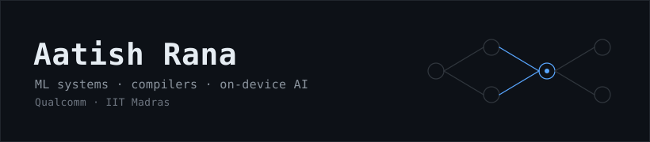

<!--
  GitHub profile README — aatishrana495/aatishrana495
  ............................................................................
  Maintenance notes
  ............................................................................
  - Sections throughout this file are marked with HTML "SECTION" comments
    so future edits are easy to locate.
  - Tone: calm, technical, grounded. No hype words, no emoji spam.
  - Do NOT include internal performance metrics (throughput, latency, or
    accuracy percentages) or proprietary mechanism details. Keep every
    claim at the public-framework level.
  - "Selected work" items stay capability-level, anchored only to
    publicly-known collaborations.
  - "Current focus" is applied-engineering framing. No research or thesis
    language in this version.
  - To add a featured repo later, use the commented pattern at the end of
    the "Featured work" section further down.
-->

<!-- SECTION: Header -->

  

<h1 align="center">Aatish Rana</h1>

  <em>Senior AI/ML Systems Engineer &nbsp;·&nbsp; on-device GenAI, ML compilers, and NPU deployment</em>

  Qualcomm &nbsp;·&nbsp; IIT Madras (MTech, Industrial AI) &nbsp;·&nbsp; NIT Rourkela (BTech, CSE)

  
  &nbsp;
  
  &nbsp;
  

---

<!-- SECTION: About -->

## About

ML systems engineer working at the intersection of deep learning compilers, runtime systems, and hardware-aware optimization for edge ML accelerators. My day-to-day sits closer to the runtime than to the notebook — where model graphs, execution providers, and silicon meet.

Background blends production deployment engineering on Windows-on-Snapdragon with graduate-level study in Industrial AI at IIT Madras.

<!-- SECTION: What I work on -->

## What I work on

- On-device and edge AI deployment for transformer and diffusion workloads
- Execution providers and runtime behavior across **ONNX Runtime**, **QNN EP**, **DirectML**, and **WinML**
- Graph-level optimization, fusion, layout, and dtype legality on ONNX graphs
- Kernel-level optimization along Conv / GEMM / attention / activation paths
- Quantization and calibration (INT8 / INT4) for transformer-class models
- **Olive + WinML** enablement pathways for on-device model delivery

<!-- SECTION: Selected work — keep items capability-level, no internal metrics -->

## Selected work

- Contributed to enabling **Stable Diffusion v1.5 on Windows-on-Snapdragon** — the publicly-announced Qualcomm + Microsoft collaboration bringing on-device generative AI to the NPU.
- Work on on-device GenAI and NPU-facing model enablement across Windows platforms.
- Execution-provider and runtime integration across the ONNX Runtime / QNN EP / DirectML / WinML ecosystem.
- Graph-level optimization, kernel tuning, and quantization practice applied to transformer and diffusion workloads.
- *Young Technocrat Award* &mdash; external recognition.

<!-- SECTION: Systems stack -->

## Systems stack

**Compilers &amp; runtimes** &mdash; ONNX Runtime, QNN EP, DirectML, WinML, Olive, ONNX, IR-level graph transformations
 **Hardware targets** &mdash; Qualcomm NPUs (Hexagon / HTP), Snapdragon X, ARM64, x64
 **Models &amp; frameworks** &mdash; PyTorch, Hugging Face Transformers, diffusion models, quantization toolchains (INT8 / INT4)
 **Languages** &mdash; C++, Python, C
 **Perf &amp; debugging** &mdash; Profiling, tracing, kernel-level analysis, hardware-in-the-loop benchmarking
 **Platforms** &mdash; Windows-on-Snapdragon, Linux

<!-- SECTION: Current focus -->

## Current focus

- Deployment-time optimization for transformer and diffusion workloads on edge accelerators
- Compile-time vs. runtime tradeoffs across ONNX Runtime execution providers
- Mixed-precision (INT4 / INT8 / FP16) scheduling for transformer blocks
- Reproducible hardware-in-the-loop benchmarking

<!-- SECTION: Featured work -->

## Featured work

Most of my production work is proprietary and lives in internal repositories. Public artifacts, writeups, and benchmark harnesses will land here as they become shareable.

<!--
  To add a featured repo later, use this pattern and place it above this comment:

  - **[repo-name](https://github.com/aatishrana495/repo-name)** — one-line description.
    _Why it matters:_ one-line context on the problem it addresses.
-->

<!-- SECTION: Contact -->

## Contact

  <a href="mailto:aatishrana495@gmail.com">aatishrana495@gmail.com</a>
  &nbsp;·&nbsp;
  <a href="https://www.linkedin.com/in/aatish-rana-a53790216/">LinkedIn</a>
  &nbsp;·&nbsp;
  <a href="https://github.com/aatishrana495">GitHub</a>

